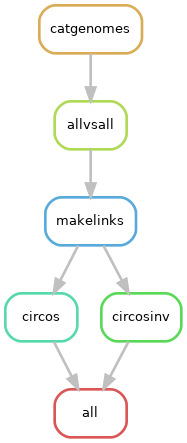

# Circos plot of *Podospora* spp

A pipeline to produce Circos plots with the alignment of a representative strain from each *Podospora* species.

## Building the environment

I ran the pipeline under a [Conda](https://docs.anaconda.com/) environment. Install it first. If you like, you can start by updating it.

    $ conda update -n base conda

To create the environment arbitrarily named `Circos`:

    $ conda create -n Circos -c bioconda snakemake-minimal=5.4.4 

To install software, activate the environment.

    $ conda activate Circos

Now install:

    $ conda install -c bioconda circos=0.69.6=1
    $ conda install -c bioconda perl-app-cpanminus=1.7044
    $ conda install -c bioconda mummer4=4.0.0beta2    

Some Perl packages are necessary for Circos:

    $ cpanm Clone Config::General Font::TTF::Font GD GD::Polyline Math::Bezier Math::Round Math::VecStat Params::Validate Readonly Regexp::Common SVG Set::IntSpan Statistics::Basic Text::Format

## The configuration file

The configuration file only contains the path to the 3 genomes in focus. I chose a representative of *P. anserina* that has the block, our new *P. pauciseta* genome, and the reference genome of *P. comata* ([Silar et al. 2018](https://link.springer.com/article/10.1007/s00438-018-1497-3)). This files exclude the mitochondria for convenience and have the sample name in each scaffold so I can keep track.
        
    $ cat Circos_config.yaml
```yaml
### Circos plot of Podospora spp
### ----------------------------------
# The Circos configuration files must be in a folder called "circos" in the
# working directory

# Genomes that already exclude the mitochondrial scaffold
anserina: "data/PaWa58m_chrs.fa"
pauciseta: "data/CBS237.71m_chrs.fa"
comata: "data/comataT_chrs.fa"
```

## The Circos file

In the repo I'm including a folder called `circos` which in turn has a `etc` folder with all the configuration files. I also have a `karyotype_podospora_chrs.txt` file used to define the chromosomes in the figure.

## Run pipeline locally

Get into the folder with this repo's content, for example:

    $ cd /home/lore/1_SpokPaper/2_Circos/

First, to get an idea of how the pipeline looks like we can make a rulegraph:

    $ snakemake --snakefile Circos.smk --configfile Circos_config.yaml --rulegraph | dot -Tpng > rulegraph.png



For testing:

    $ snakemake --snakefile Circos.smk --configfile Circos_config.yaml -pn

Now you can run the pipeline. I like to make screen first, then activate the environment, and finally run the pipeline in the background.

    $ screen -R Circos
    # Important to activate environment!!
    $ conda activate Circos
    $ snakemake --snakefile Circos.smk --configfile Circos_config.yaml -p -j 10 --keep-going &> Circos.log &

Notice `-j` stands for the number of threads that you want to give to your pipeline. See [Snakemake](https://snakemake.readthedocs.io/en/stable/) documentation for more information.

The results are `png` and `svg` files for the full synteny case (main figure) and for the inversions alone (supplementary) in the `circos` folder. I used the `png` file to make the main figure because it keeps the transparency values, while I used the `svg` for the supplementary in order to see the very thin lines.
