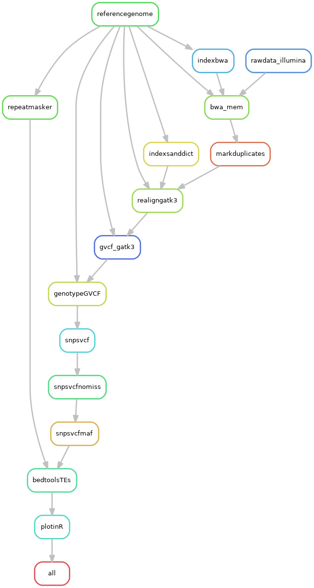

# Backcrosses: Analysis of the SNP distribution of 5x backcrosses of killers to strain S

## Building the environment

This pipeline relies on the VariantCalling environment (but you can call it as you wish), which looks like this:

    $ conda update -n base conda

Now, to create the environment.

    $ conda create -n VariantCalling -c bioconda snakemake-minimal=5.3.0 picard=2.18.11 bwa=0.7.17 samtools=1.9 vcftools=0.1.16

In order to mask repeats, I also need RepeatMasker and accessories.
    
    # First I'll activate it to install installing things inside
    $ conda activate VariantCalling
    $ conda install -c bioconda repeatmasker=4.0.7=pl5.22.0_11
    $ conda install -c bioconda bedtools=2.27.1=he941832_2
    $ conda install -c bioconda bcftools=1.9=h4da6232_0

The last part of the pipeline plots the result in R, so I'll need:

    $ conda install -c r r-base=3.5.1=h1e0a451_2
    $ conda install -c conda-forge r-ggplot2=3.1.0=r351h6115d3f_1000 r-reshape2=1.4.3=r351h9d2a408_2 r-dplyr=0.7.6=r351h9d2a408_1
    $ conda install -c bioconda r-poppr=2.8.1=r351h470a237_0 r-vcfr=1.8.0=r351h9d2a408_0

And save it in a file.

    $ conda env export > Backcrosses_env.yml

**AN IMPORTANT CAVEAT TO THIS:** My installation of GATK3 is LOCAL. Meaning that I didn't install it along with this environment. The reason is that it requires to download a license ... Instead I have installed locally in the cluster and call that within the snakemake pipeline. It's unfortunate, but this will change with GATK4. The reason why I kept it in GATK3 is because I used the `IndelRealigner` function externally for my Pilon polishing in the genome assemblies. Hence, I decided to stick to a single methodology for producing BAM files, including the SNP calling. In reality using GATK4 would have no effect on our conclusions, since we only need coarse results, not accurate variant calling.

## Repeats

In order to mask repeats we used the sequences of the TEs described in [Espagne et al. (2008)](https://genomebiology.biomedcentral.com/articles/10.1186/gb-2008-9-5-r77) (or those that we could find), plus the RepBase database for fungi, and the *Neurospora* library from [Gioti et al. (2012)](https://academic.oup.com/mbe/article/29/10/3215/1031597).

Below, watch out for the path to the scripts:

    $ /path_to_repeatmasker/util/queryRepeatDatabase.pl -species fungi > FungiRepbase.lib
    queryRepeatDatabase
    ===================
    RepeatMasker Database: RepeatMaskerLib.embl
    Version: RepeatMasker Combined Database: Dfam_Consensus-20170127, RepBase-20170127
    Species: fungi ( fungi )

Ok, now I'll fuse all the libraries.

    $ cat FungiRepbase.lib PodosporaTEs_Espagne.lib Gioti_neurospora_repeats.renamed.lib > FungiRepbaseEspagneGioti.lib

## Configuration file

This pipeline depends on a given configuration yaml file including the samples, the path to the data, and the reference. Below it's an example, but make sure the paths are correct for you!

    $ cat Backcrosses_config.yml

```yaml
    # List of samples to analyze
    SampleIDs: ["Pa170m", "Pa180p", "Pa130p", "Pa200p", "PaSp", "PaSm", "PaWa53p", "PaWa58m", "PaWa28m", "PaYp"]
    SampleIDsOthers: ["PaWa21m", "PaWa46p", "PaWa63p", "PaWa87m", "PaWa100p", "PaTgp", "CBS237.71m", "PcTdp"]

    # Path to Illumina samples
    Illumina: "path_to_IlluData/"

    # The reference genome
    Podan2file: "extras/Podan2_AssemblyScaffoldsmt.fa"

    # My local installation of GATK3
    gatk3: "localpath/GenomeAnalysisTK.jar"

    TElib: "extras/FungiRepbaseEspagneGioti.lib"

    rscript: "scripts/FigS6_Backcrosses.R"
```

The configuration file includes the rscript that does the plotting in the end, so that has to be provided too!

## Run pipeline in slurm server (like Uppmax)

Get into the folder:

    $ cd Backcrosses

First, to get an idea of how the pipeline looks like we can make a rulegraph. 

In Mac, you need to install graphviz to run the following command. For that you can do `brew install graphviz` using Homebrew, for example. It otherwise works well in Ubuntu.

    $ snakemake --snakefile Backcrosses.smk --configfile Backcrosses_config.yml --rulegraph | dot -Tpng > rulegraph.png



Run the pipeline:

    $ screen -R Backcrosses
    # Important to activate environment!!
    $ conda activate VariantCalling

Test it:

    $ snakemake --snakefile Backcrosses.smk --configfile Backcrosses_config.yml -pn

To run in local computer:

    $ snakemake --snakefile Backcrosses.smk --configfile Backcrosses_config.yml -p

To run the pipeline in a slurm cluster:

    $ snakemake --snakefile Backcrosses.smk --configfile Backcrosses_config.yml -p --cluster "sbatch -A projectname -p core -n {params.threads} -t {params.time} --mail-user your@mail.com --mail-type=ALL" -j 10 --keep-going &> Backcrosses.log &

Notice that sometimes GATK freaks out and crashes if more than one thread is used. So I you can run it with one thread.
